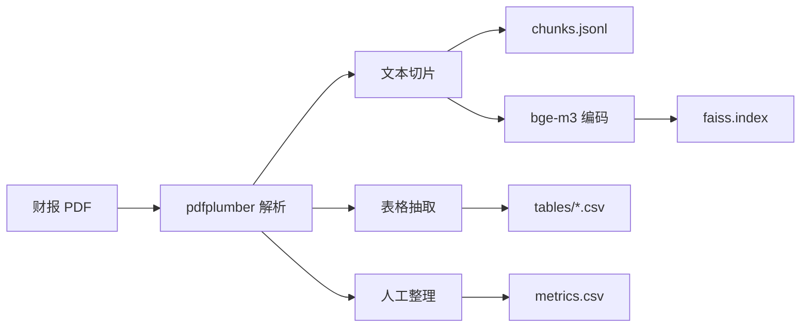
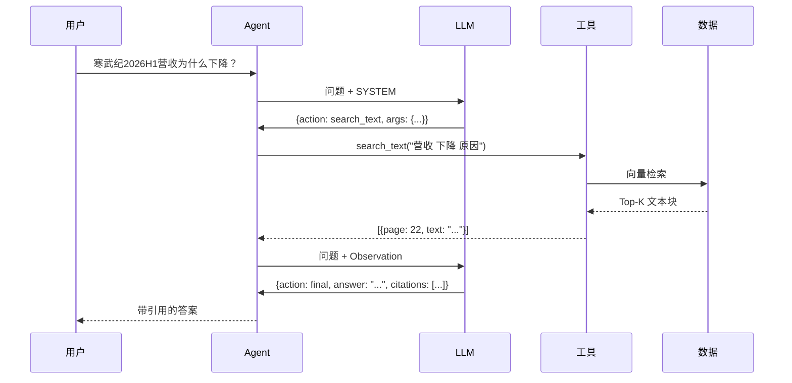
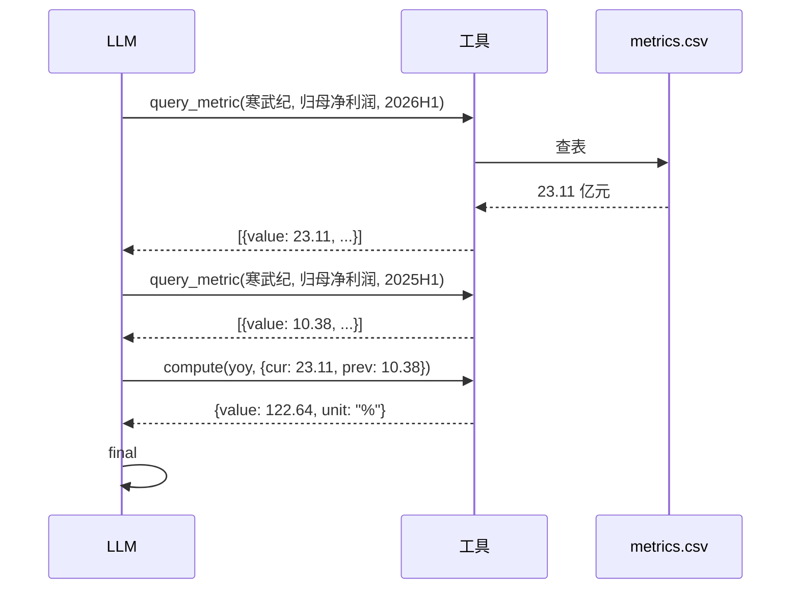

# 架构文档

本文档描述 FinReport Agent 的整体架构、核心组件、数据流与关键设计决策。

---

## 目录

- [1. 系统概览](#1-系统概览)
- [2. 分层架构](#2-分层架构)
- [3. 核心组件](#3-核心组件)
- [4. 数据流](#4-数据流)
- [5. 关键设计决策](#5-关键设计决策)
- [6. 错误处理与容错](#6-错误处理与容错)
- [7. 扩展点](#7-扩展点)
- [8. 性能与资源](#8-性能与资源)

---

## 1. 系统概览

FinReport Agent 是一个 **ReAct 范式的财报问答智能体**。它的核心思想是：

> **把 LLM 定位为"决策器"，而不是"知识源"。所有事实性内容来自工具，LLM 只负责判断下一步该做什么。**

架构如下：

```
LLM 决策 → 工具执行 → 观察反馈 → LLM 再决策 → ... → 最终答案
```

与传统 RAG 的区别

| 维度 | 传统 RAG | FinReport Agent |
|---|---|---|
| 流程 | 固定：检索 → 生成 | 动态：LLM 决定检索/计算/追问 |
| 步数 | 1 步 | 多步（典型 2~5 步） |
| 数值准确性 | 依赖 LLM 读表 | 强制走结构化指标库 |
| 可引用性 | 引用为生成内容 | 引用为工具真实返回 |
| 失败模式 | 幻觉数字 | 步数超限 / 工具调用错误 |

---

## 2. 分层架构

```
┌──────────────────────────────────────────────────────────┐
│                     用户接口层                            │
│  main.py (CLI)  |  eval.py (评测)  |  [Web UI 待扩展]    │
└──────────────────────────────────────────────────────────┘
                          ↓
┌──────────────────────────────────────────────────────────┐
│                     Agent 编排层                          │
│  agent.py: run_agent()                                   │
│    - ReAct 循环                                          │
│    - 输出解析 (strip_think + parse_action)               │
│    - 重复动作检测                                         │
│    - 步数控制 + search 失败计数                          │
└──────────────────────────────────────────────────────────┘
                          ↓
┌──────────────────────────────────────────────────────────┐
│                     决策层 (LLM)                         │
│  prompt.py: SYSTEM prompt                                │
│  call_llm()  →  Ollama / llama.cpp              │
│    - 问题分类（原因/数值/混合/合规）                     │
│    - 工具选择                                            │
│    - 参数生成                                            │
└──────────────────────────────────────────────────────────┘
                          ↓
┌──────────────────────────────────────────────────────────┐
│                      工具层                              │
│  tools.py                                                │
│    query_metric | search_text | search_table             │
│    read_table   | compute      | verify_citation         │
└──────────────────────────────────────────────────────────┘
                          ↓
┌──────────────────────────────────────────────────────────┐
│                     数据层                               │
│  metrics.csv   |  chunks.jsonl  |  faiss.index           │
│  tables/*.csv  |  pdfs/*.pdf                             │
└──────────────────────────────────────────────────────────┘
```

---

## 3. 核心组件

### 3.1 Agent 编排层（`agent.py`）

Agent 的核心是 `run_agent()` 函数，实现 ReAct 循环。

```python
def run_agent(question, max_step=8):
    history = [system_prompt, user_question]
    seen_actions = []
    search_fail_streak = 0
    
    for step in range(max_step):
        resp = call_llm(history)
        action = parse_action(resp)          # 剥离 think + 提取 JSON
        
        if action is final:
            return answer
        
        obs = execute_tool(action)            # 执行工具
        history.append(tool_observation)      # 回填结果
        
        # 每轮重述原问题，防止目标漂移
        # search 失败计数，超限强制结束
```

**关键机制**：

| 机制 | 作用 |
|---|---|
| `strip_think` | 去掉 Qwen3.5 的 `<think>` 块 |
| `parse_action` | 从任意文本里提取 JSON |
| `seen_actions` | 防止同一工具同一参数重复调用 |
| `search_fail_streak` | 连续 2 次 search 失败 → 在 observation 里禁止再用 search_text |
| 每轮重述原问题 | 防止模型被中间结果带偏 |
| `max_step` | 硬性终止，避免死循环 |

### 3.2 决策层（`prompt.py`）

**System Prompt** 是 Agent 的"行为准则"，包含：

1. **问题分类规则**：原因词优先
2. **工具使用规则**：参数格式、容错逻辑
3. **输出格式**：严格 JSON
4. **硬性约束**：数字来源、引用、合规

**LLM 接口**：通过 Ollama 的 OpenAI 兼容接口 `/v1/chat/completions` 调用。当前从模型文本里解析 JSON action，未走原生 `tools` / function calling。

```python
def call_llm(messages):
    resp = requests.post(
        "http://127.0.0.1:11434/v1/chat/completions",
        json={
            "model": "qwen3.5:9b-q4_K_M",
            "messages": messages,
            "stream": False,
            "think": False,
        },
    )
    return resp.json()["choices"][0]["message"]["content"]
```

### 3.3 工具层（`tools.py`）

6 个工具分为 3 类：

| 类别 | 工具 | 用途 |
|---|---|---|
| **数值** | `query_metric` | 从 `metrics.csv` 精确查指标 |
| **检索** | `search_text` | bge-m3 + FAISS 向量检索 |
| | `search_table` | 关键词匹配表格 |
| | `read_table` | 读取表格行列 |
| **计算** | `compute` | 白名单公式计算 |
| **验证** | `verify_citation` | 校验数字是否被证据支持 |

### 3.4 数据层

```
data/
├── pdfs/               # 原始财报 PDF
├── chunks.jsonl        # 文本切片（id, page, text）
├── tables/             # PDF 抽取的表格（p{page}_t{idx}.csv）
└── metrics.csv         # 结构化指标库（核心）

index/
└── faiss.index         # bge-m3 向量索引
```

**`metrics.csv` 是灵魂**：所有数值型问题的答案来源。

```csv
company,period,metric,value,unit,source_table,page,note
寒武纪,2026H1,营业收入,59.96,亿元,合并利润表,62,合并报表
```

---

## 4. 数据流

### 4.1 离线数据准备



### 4.2 在线问答流程



### 4.3 数值查询流程（多步计算）



---

## 5. 关键设计决策

### 5.1 为什么用 `metrics.csv`，而不是让 LLM 直接读表格？

**问题**：财报表格解析噪声大（合并单元格、单位混杂、多期并列），LLM 抽数容易错。

**方案**：把核心指标**提前标准化**成 `company-period-metric-value` 四元组。

**代价**：需要人工整理，扩展性受限。

**收益**：
- 数值准确率从"依赖 LLM"变成"依赖数据"
- `query_metric` 一步返回结果，不占上下文
- 幻觉率趋近于 0

**Demo 阶段取舍**：宁可少收录几个指标，也不让 LLM 自己算。

### 5.2 为什么问题分类要"原因词优先"？

**反例**：
> "经营现金流为什么下降？"

早期规则按关键词分类，模型看到"经营现金流"就归类为**数值类**，先绕 3 步查数，再回到原因检索。

**新规则**：
```
第一刀：出现"为什么/原因/风险/看法" → 原因类
第二刀：出现"多少/几/同比" → 数值类
```

**关键**：**原因词一旦出现，压过所有指标名。**

### 5.3 为什么不预分类，让 LLM 自己选工具？

**预分类的缺点**：
- 关键词表维护成本高，边界 case 永远漏
- 判错一次，后面全错

**LLM 自纠的优势**：
- `query_metric` 返回 `error + available_metrics`，模型能立刻纠错
- `search_fail_streak` 机制能强制拉回
- 分类责任和工具选择合并，少一个环节

**结论**：**分类是 LLM 的事，不需要外挂规则。**

### 5.4 为什么每轮重述原问题？

**问题**：多步工具调用后，模型会**目标漂移**。

**案例**：
```
用户问：资产负债率是多少？
Step 1-4：找资产、找负债、找流动资产...
Step 5-8：开始算流动比率（已经忘了原问题）

```

**修复**：每次工具返回后，把原始问题重新拼进消息：

```python
reminder = (
    f"工具 {tool_name} 返回：{obs_str}\n\n"
    f"【原始问题】{question}\n"
    f"请继续，不要偏离原问题。"
)
```

### 5.5 为什么要禁止 LLM 自己算？

**反例**：
> 用户问毛利率，`metrics.csv` 未收录。Agent 从 `search_text` 里抽营业成本和营业收入，心算得 55.25%。

**问题**：
- LLM 心算无监督，算错用户不知道
- 数值精度问题（四舍五入误差）
- 结论可追溯性差

**修复**：两条规则
1. `metrics.csv` 能预计算的**全部预计算**
2. Prompt 明确写"查不到就拒答，禁止 search_text 自己抽数"

### 5.6 为什么用 ReAct 而不是 Plan-and-Execute？

| 方案 | 优点 | 缺点 | 适用 |
|---|---|---|---|
| **ReAct** | 灵活、边做边看 | 步数不可控 | 问题类型多样 |
| Plan-and-Execute | 全局规划 | 前期规划成本高，不适合简单问题 | 复杂、可分解任务 |

**财报问答 80% 是 2~3 步的简单问题**，ReAct 更合适。

---

## 6. 错误处理与容错

| 错误类型 | 检测点 | 处理策略 |
|---|---|---|
| LLM 输出非 JSON | `parse_action` 抛异常 | 重新提示模型，最多重试 3 次 |
| 工具参数错误 | `TypeError` 捕获 | 返回 `expected_args` 供模型自纠 |
| 工具名拼错 | `TOOLS.get()` 返回 None | 返回 `available_tools` |
| 指标未收录 | `query_metric` 返回 `error` | 返回 `available_metrics`，模型据此拒答 |
| 重复动作 | `seen_actions` 命中 | 返回提示，要求换工具或 final |
| 目标漂移 | search 连续失败 | `search_fail_streak >= 2` 警告并禁止再用 search_text |
| 步数超限 | `step >= max_step` | 返回 fallback 答案 |

---

## 7. 扩展点

### 7.1 增加新指标

只需两步：

```csv
# metrics.csv
寒武纪,2026H1,销售费用率,5.2,%,计算,62,销售费用/营业收入
```

```python
# tools.py 的 METRIC_ALIAS
"销售费用率": "销售费用率",
"销售费用占比": "销售费用率",
```

无需改代码逻辑。

### 7.2 增加新工具

```python
def new_tool(param1, param2):
    """工具的 docstring 会被注入 prompt"""
    return result

TOOLS = {
    "new_tool": new_tool,
    ...
}
```

同时在 `SYSTEM` prompt 的工具列表里加一行。

### 7.3 接入多公司 / 多期

只需扩展 `metrics.csv`：

```csv
寒武纪,2026H1,营业收入,59.96,亿元,...
寒武纪,2025H1,营业收入,28.81,亿元,...
宁德时代,2026H1,营业收入,...
```

`query_metric(company, metric, period)` 天然支持多公司。

### 7.4 换 LLM

`call_llm` 是唯一依赖 LLM 的地方，换模型只需改：

```python
# ollama → openai
from openai import OpenAI
client = OpenAI(base_url="https://api.openai.com/v1", ...)
```

**前提**：新模型必须支持 function calling。

### 7.5 从 ReAct 升级到 LangGraph

`run_agent` 的核心循环可以映射到 LangGraph 状态机：

```
State = {
    question, history, step, seen_actions, observations
}

Nodes = {
    "plan":     调用 LLM 生成 action
    "execute":  执行工具
    "verify":   校验结果
    "finalize": 输出最终答案
}

Edges = {
    "plan" → "execute" | "finalize"
    "execute" → "plan"
    "verify" → "plan" | "finalize"
}
```

**迁移时机**：当工具数 > 15，或需要复杂条件分支时。

---

## 8. 性能与资源

### 8.1 硬件要求

| 组件 | 需求 |
|---|---|
| 内存 | ≥ 16GB（推荐 24GB） |
| 存储 | 模型 ~5.5GB + 索引 ~100MB + PDF |
| 平台 | macOS (Apple Silicon) / Linux |

### 8.2 关键指标（MacBook Pro M 系列，24GB）

| 指标 | 数值 |
|---|---|
| 模型加载时间 | ~5s |
| 推理速度 | ~35 tokens/s |
| 单步延迟 | 1~3s |
| 20 题评测总耗时 | ~15 分钟 |
| 平均步数 | 2.4~3.6 |

### 8.3 上下文预算

```
总 ctx = 4096 tokens

- system prompt     ~600
- 对话历史         ~1500（含工具返回）
- 当前 thought     ~200
- 输出预留         ~500
= 可用余量         ~1300
```

**关键**：控制 System Prompt 长度在 700 token 以内，避免挤压工具返回空间。

### 8.4 常见性能瓶颈

| 瓶颈 | 原因 | 优化 |
|---|---|---|
| 首 token 延迟高 | Prompt 太长 | 精简 prompt |
| 响应慢 | 上下文占满 | 截断 search_text 返回 |
| 步数过多 | 目标漂移 | 每轮重述原问题 |
| 模型输出慢 | 生成 token 多 | 限制 max_tokens |
