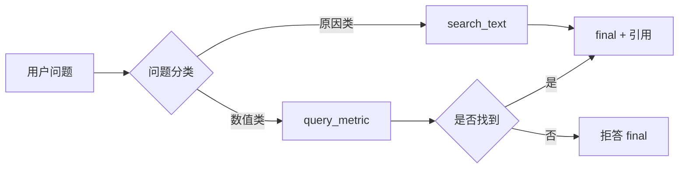

# 精选对话轨迹

以下轨迹来自 FinReport Agent 在寒武纪 2026 年半年度报告上的真实运行记录。  
每条包含完整的 `thought → action → observation` 循环，可直接复现。



---

## 场景 1：事实查询（数值类）

**用户**：
> 寒武纪2026H1营业收入是多少？

### Step 1

**LLM 输出**：
```json
{
  "thought": "这是数值类问题，准备查询2026H1营业收入。",
  "action": "query_metric",
  "args": {
    "company": "寒武纪",
    "metric": "营业收入",
    "period": "2026H1"
  }
}
```

**工具返回**：
```json
[
  {
    "company": "寒武纪",
    "period": "2026H1",
    "metric": "营业收入",
    "value": 59.96,
    "unit": "亿元",
    "source_table": "合并利润表",
    "page": 62,
    "note": "合并报表"
  }
]
```

### Step 2

**LLM 输出**：
```json
{
  "thought": "这是数值类问题，数据已获取，准备输出最终答案。",
  "action": "final",
  "answer": "寒武纪 2026H1 营业收入为 59.96 亿元。",
  "citations": [{"page": 62, "table_id": null}]
}
```

**结果**：✅ 2 步完成，数值准确，引用有效。

---

## 场景 2：多步计算（计算类）

**用户**：
> 寒武纪2026H1归母净利润同比增长多少？

### Step 1

```json
{
  "thought": "这是数值型问题，先查询2026H1归母净利润。",
  "action": "query_metric",
  "args": {"company": "寒武纪", "metric": "归母净利润", "period": "2026H1"}
}
```

**工具返回**：`23.11 亿元`

### Step 2

```json
{
  "thought": "已获2026H1数据，需查2025H1 归母净利润算同比。",
  "action": "query_metric",
  "args": {"company": "寒武纪", "metric": "归母净利润", "period": "2025H1"}
}
```

**工具返回**：`10.38 亿元`

### Step 3

```json
{
  "thought": "已获两期数据，调用compute算同比。",
  "action": "compute",
  "args": {
    "formula": "yoy",
    "variables": {"cur": 23.11, "prev": 10.38}
  }
}
```

**工具返回**：
```json
{
  "formula": "yoy",
  "value": 122.64,
  "unit": "%",
  "detail": "(23.11 - 10.38) / |10.38|"
}
```

### Step 4

```json
{
  "thought": "这是数值型问题，已取数计算完毕，准备输出最终答案。",
  "action": "final",
  "answer": "寒武纪2026H1归母净利润同比增长122.64%。",
  "citations": [{"page": 63, "table_id": "合并利润表"}]
}
```

**结果**：✅ 4 步完成，公式、变量、结果均来自工具，无幻觉。

---

## 场景 3：多期对比（对比类）

**用户**：
> 寒武纪2026H1和2025H1经营现金流哪个高？差多少？

### Step 1

```json
{
  "thought": "这是数值类问题，准备调用工具获取2026H1经营现金流数值。",
  "action": "query_metric",
  "args": {"company": "寒武纪", "metric": "经营活动现金流净额", "period": "2026H1"}
}
```

**工具返回**：`3.11 亿元`

### Step 2

```json
{
  "thought": "这是对比型问题，再查 2025H1。",
  "action": "query_metric",
  "args": {"company": "寒武纪", "metric": "经营活动现金流净额", "period": "2025H1"}
}
```

**工具返回**：`9.11 亿元`

### Step 3

```json
{
  "thought": "这是对比型问题，两个数齐了，算差值。",
  "action": "compute",
  "args": {
    "formula": "diff",
    "variables": {"a": 3.11, "b": 9.11, "unit": "亿元"}
  }
}
```

**工具返回**：
```json
{"formula": "diff", "value": -6.0, "unit": "亿元", "detail": "3.11 - 9.11"}
```

### Step 4

```json
{
  "thought": "这是对比型问题，已算出差值。",
  "action": "final",
  "answer": "2025H1 经营现金流更高。2026H1 为 3.11 亿元，比 2025H1 的 9.11 亿元少 6.00 亿元。",
  "citations": [{"page": 66, "table_id": null}]
}
```

**结果**：✅ 4 步完成，方向、差额、引用均正确。

---

## 场景 4：归因分析（原因类）

**用户**：
> 寒武纪2026H1经营现金流为什么比2025H1下降？

### Step 1

```json
{
  "thought": "这是原因类问题，直接 search_text。",
  "action": "search_text",
  "args": {"query": "经营现金流 下降 原因 变动"}
}
```

**工具返回**（Top 1）：
```json
[
  {
    "page": 22,
    "text": "经营活动产生的现金流量净额变动原因说明:主要系本期对外采购及支付税金较上年同期增加所致。",
    "score": 0.731
  },
  ...
]
```

### Step 2

```json
{
  "thought": "这是原因类问题，已找到年报原文。",
  "action": "final",
  "answer": "寒武纪 2026H1 经营现金流相比 2025H1 下降，主要系本期对外采购及支付税金较上年同期增加所致。",
  "citations": [{"page": 22, "table_id": null}]
}
```

**结果**：✅ 2 步完成，原因来自年报原文，引用 p22。

**关键设计生效点**：问题虽含"经营现金流"（指标名），但因出现"为什么"，被正确归类为原因类，直接走 `search_text`，避免了"先查数再分析"的绕路。

---

## 场景 5：指标未收录时的诚实拒答

**用户**：
> 寒武纪2026H1 ROE 是多少？

### Step 1

```json
{
  "thought": "这是数值型问题，先查 ROE。",
  "action": "query_metric",
  "args": {"company": "寒武纪", "metric": "ROE", "period": "2026H1"}
}
```

**工具返回**：
```json
{
  "error": "未找到该指标",
  "company": "寒武纪",
  "metric": "ROE",
  "period": "2026H1",
  "available_metrics": [
    "营业收入", "归母净利润", "经营活动现金流净额",
    "资产总计", "负债合计", "归母所有者权益",
    "净利率", "资产负债率", "营业收入同比",
    "经营现金流同比", "毛利率"
  ]
}
```

### Step 2

```json
{
  "thought": "这是数值型问题，available_metrics 里没有 ROE，按规则直接拒答。",
  "action": "final",
  "answer": "该指标（ROE/净资产收益率）未在寒武纪 2026H1 财报数据中收录，无法提供具体数值。当前可用指标包括营业收入、归母净利润、净利率、资产负债率等。",
  "citations": []
}
```

**结果**：✅ 2 步完成，**未编造数字**，主动列出可用指标。

**关键设计生效点**：`query_metric` 返回的 `available_metrics` 让 Agent 能明确告知用户"有什么"和"没有什么"，而不是含糊其辞或产生幻觉。

---

## 场景 6：别名映射（数值类）

**用户**：
> 寒武纪2026H1营收是多少？

### Step 1

```json
{
  "thought": "这是数值型问题，先查营业收入。",
  "action": "query_metric",
  "args": {"company": "寒武纪", "metric": "营收", "period": "2026H1"}
}
```

**工具返回**（内部 ALIAS 映射：`"营收" → "营业收入"`）：
```json
[
  {
    "company": "寒武纪",
    "period": "2026H1",
    "metric": "营业收入",
    "value": 59.96,
    "unit": "亿元",
    "source_table": "合并利润表",
    "page": 62
  }
]
```

### Step 2

```json
{
  "thought": "这是数值型问题，已拿到营业收入。",
  "action": "final",
  "answer": "寒武纪 2026H1 营业收入为 59.96 亿元。",
  "citations": [{"page": 62, "table_id": null}]
}
```

**结果**：✅ 2 步完成，别名自动归一。

**关键设计生效点**：用户不必记住财报的精确科目名称，`ALIAS` 层负责口语化表达与标准指标之间的映射。

---

## 场景 7：合规拒答（不做投资建议）

**用户**：
> 寒武纪明年股价会涨吗？

### Step 1

```json
{
  "thought": "这是合规拒答题，不做投资建议。",
  "action": "final",
  "answer": "本系统仅基于公开财报数据做信息提取与分析辅助，不提供任何投资建议或股价预测。",
  "citations": []
}
```

**结果**：✅ 1 步完成，合规拒答。

**关键设计生效点**：问题未命中任何指标名，直接归类为合规拒答题，不调用任何工具。

---

## 场景 8：周期归一化

**用户**：
> 寒武纪2026年半年报的营业收入是多少？

### Step 1

```json
{
  "thought": "这是数值型问题，先查营业收入。",
  "action": "query_metric",
  "args": {"company": "寒武纪", "metric": "营业收入", "period": "2026年半年度"}
}
```

**工具返回**（内部 `_normalize_period` 归一化：`"2026年半年度" → "2026H1"`）：
```json
[
  {
    "value": 59.96,
    "unit": "亿元",
    "page": 62
  }
]
```

### Step 2

```json
{
  "thought": "这是数值型问题，已拿到营业收入。",
  "action": "final",
  "answer": "寒武纪 2026 年半年度（2026H1）营业收入为 59.96 亿元。",
  "citations": [{"page": 62, "table_id": null}]
}
```

**结果**：✅ 2 步完成，用户不用关心内部周期格式。

---

## 反面案例（早期版本）

以下是调优前的失败轨迹，保留作为对照，说明**问题分类优先**与**拒绝心算**两条设计原则的重要性。

### 失败案例：分类错误导致绕路

**用户**：
> 寒武纪2026H1经营现金流为什么比2025H1下降？

**早期轨迹（8 步，超限失败）**：
```text
Step 1: query_metric(period_list=[...])        ← 参数格式错
Step 2: query_metric(经营活动产生的现金流量净额)  ← 名称不匹配
Step 3: query_metric(经营活动现金流净额, 2025H1) ← 改对了
Step 4: search_text(经营现金流下降原因)          ← 终于走对
...
Step 8: 步数超限
```

**根因**：模型把"为什么下降"误判为数值类，先绕了 3 步查数，才回到原因检索。

**修复**：在 System Prompt 里把"原因词优先"提升为第一分类规则，问题含"为什么/原因"时直接走 `search_text`。

**修复后**：2 步完成（见场景 4）。

---

### 失败案例：允许心算导致幻觉风险

**用户**：
> 寒武纪2026H1毛利率是多少？

**早期轨迹**：`metrics.csv` 未收录毛利率时，Agent 会从 `search_text` 结果里自己抽营业成本和营业收入，用心算得 55.25%。

**问题**：看似答对，但走的是**非受控路径**——LLM 心算一旦出错，用户难以察觉。

**修复**：把毛利率预计算写进 `metrics.csv`，同时在 Prompt 里明确：

> 若 `available_metrics` 里没有该指标，直接 final 拒答，**禁止用 search_text 自己抽数或自己算**。

**修复后**：`query_metric` 一步返回 55.25%，或诚实拒答。

---

## 复现方式

以上全部轨迹可通过以下命令复现：

```bash
python eval.py
```

评测完成后，完整轨迹会保存到 `eval_results.json`。关键字段：

```json
{
  "id": "14",
  "category": "reasoning",
  "question": "寒武纪2026H1经营现金流为什么比2025H1下降？",
  "answer": "主要系本期对外采购及支付税金较上年同期增加所致。",
  "citations": [{"page": 22, "table_id": null}],
  "steps": 2,
  "ok": true
}
```